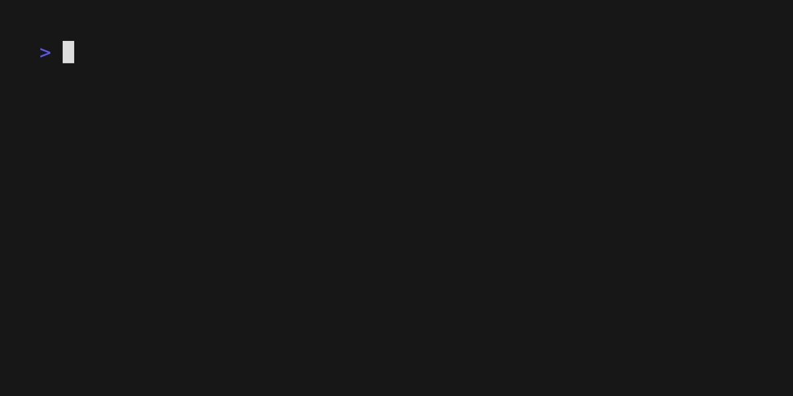

# Comet

Control SSH tunnels from any SSH client terminal with simplicity.

in this demo, localhost:8080 (client) is forwarded to localhost:1002 (server).

## As Go Package
Programmatically manage SSH tunnels with Comet, built as a [Wish](https://github.com/charmbracelet/wish) extension
package.
